# Genshin Impact themes for Potassium

Seven animated Genshin Impact themes for the Potassium executor. Each one has its own colour palette, its own layout and its own Japanese labels, with a looping wallpaper playing behind the whole app.

| Theme | Base theme | Look |
|---|---|---|
| [Yae Miko](#yae-miko--八重神子) | Dark | Sakura-pink shrine glass, pill tabs, floating explorer card |
| [Kujou Sara](#kujou-sara--九条裟羅) | **Light** | Paper and ink, square corners, black title band, crimson status bar, seal stamp |
| [Moontide Sea](#moontide-sea--月潮の海) | Dark | Deep-sea glass, glowing floating panels, gradient heading |
| [Bride Furina](#bride-furina--フリーナ) | **Light** | Frosted veil, serif type, centred tabs, double borders |
| [Sea of Flowers](#sea-of-flowers--花の海) | Dark | Minimal starfall, monospace labels, shooting-star tab underline |
| [Raiden Shogun](#raiden-shogun--雷電将軍) | Dark | Electric violet, Raiden in the rain, slanted tabs, glowing seam |
| [Clorinde](#clorinde--クロリンデ) | Dark | Fontaine duelist, midnight teal and brass gold, art-deco frame, diamond markers |

Previews are animated (AVIF) and show the Start page, a script tab and the loading screen at full size. Browsers that can't play AVIF show a still screenshot instead.

## Install

1. In Potassium, open **Settings → Appearance → Custom theme**.
2. Set **Base theme** to the one listed for that theme (Dark or **Light**). The editor's syntax colours come from the base theme.
3. Open the theme's folder, copy everything in its `Theme.css` and paste it into **Custom CSS**.
4. Type a name under **Save** and click **Save**.

## Loading screen

Every theme also replaces Potassium's own loading and login picture with its wallpaper, softly blurred, so the theme starts the moment the app opens. Each theme's loading screen is shown under its preview.

## Labels in every theme

| Text | Reading | Meaning |
|---|---|---|
| カリウム | karyūmu | Potassium |
| スクリプト | sukuriputo | Scripts |
| 自動実行 | jidō jikkō | Auto execute |
| 出力 | shutsuryoku | Output (console) |
| 問題 | mondai | Problems |
| 始める | hajimeru | Start |
| 最近 | saikin | Recent |
| 今日のヒント | kyō no hinto | Tip of the day |

Each theme below also has its own text; open **What the Japanese means** under its preview.

## Yae Miko · 八重神子

<picture>
  <source srcset="yae-miko/screens.avif" type="image/avif">
  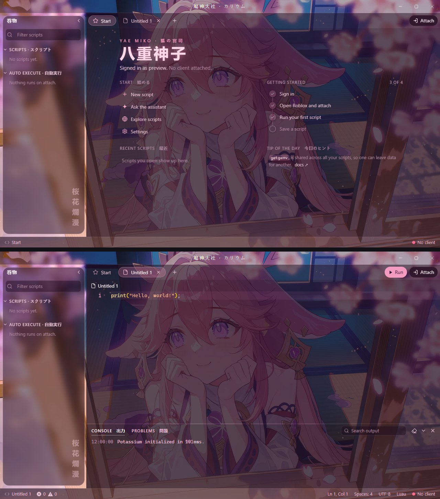
</picture>

<picture>
  <source srcset="yae-miko/loading.avif" type="image/avif">
  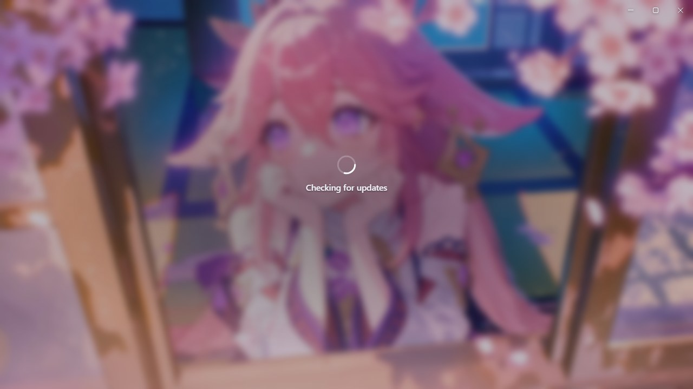
</picture>

[`Theme.css`](yae-miko/Theme.css) · Base: Dark · 鳴神大社 · 巻物 · 桜花爛漫

What the Japanese means

| Text | Reading | Meaning |
|---|---|---|
| 鳴神大社 | Narukami Taisha | Grand Narukami Shrine, the shrine Yae Miko runs (title bar) |
| 巻物 | makimono | Scrolls (explorer) |
| 狐の宮司 | kitsune no gūji | The fox head priestess |
| 八重神子 | Yae Miko | Her name |
| 桜花爛漫 | ōka ranman | Cherry blossoms in full bloom |

## Kujou Sara · 九条裟羅

<picture>
  <source srcset="kujou-sara/screens.avif" type="image/avif">
  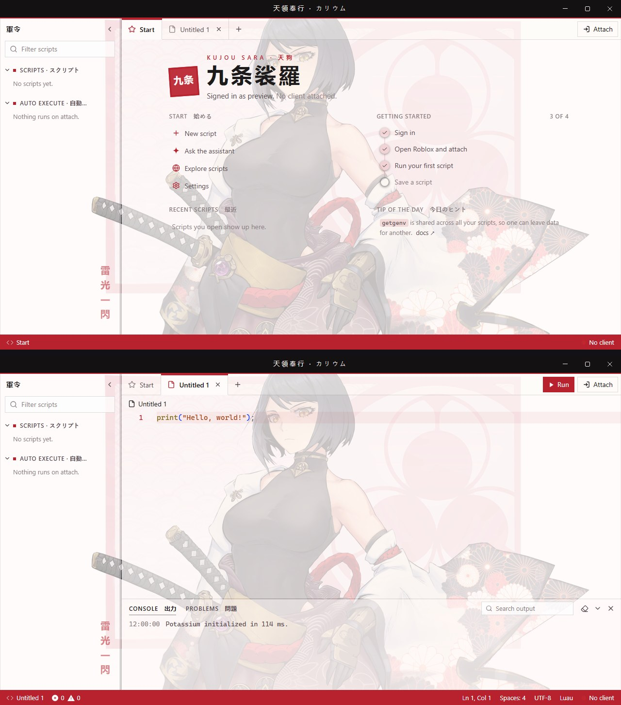
</picture>

<picture>
  <source srcset="kujou-sara/loading.avif" type="image/avif">
  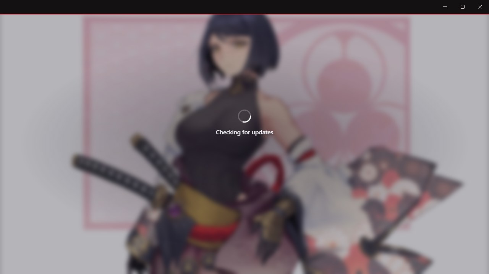
</picture>

[`Theme.css`](kujou-sara/Theme.css) · Base: **Light** · 天領奉行 · 軍令 · 雷光一閃

What the Japanese means

| Text | Reading | Meaning |
|---|---|---|
| 天領奉行 | Tenryō Bugyō | The Tenryou Commission, Inazuma's army (title bar) |
| 軍令 | gunrei | Military orders (explorer) |
| 天狗 | tengu | Tengu, the crow-winged yokai she is |
| 九条裟羅 | Kujō Sara | Her name |
| 九条 | Kujō | Her clan name (the red seal) |
| 雷光一閃 | raikō issen | A single flash of lightning |

## Moontide Sea · 月潮の海

<picture>
  <source srcset="moontide/screens.avif" type="image/avif">
  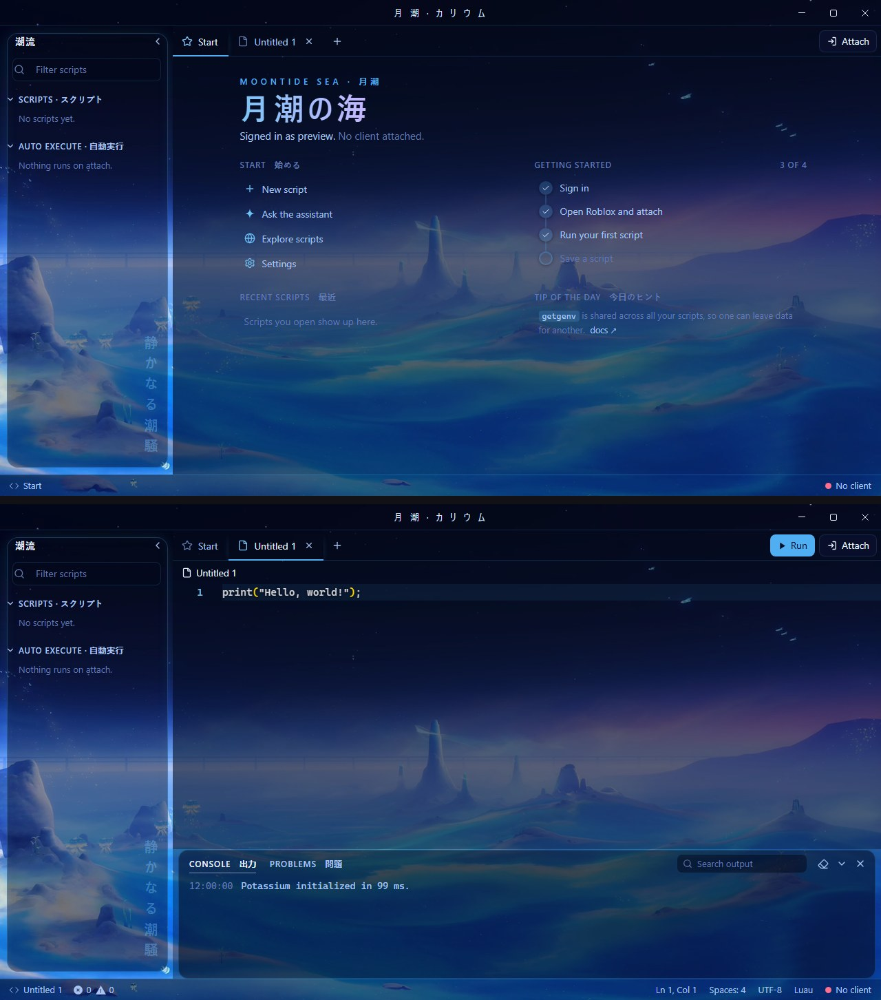
</picture>

<picture>
  <source srcset="moontide/loading.avif" type="image/avif">
  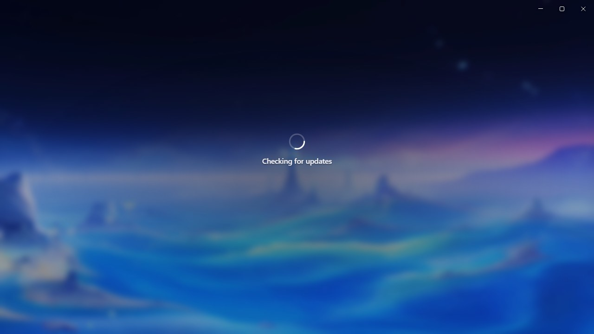
</picture>

[`Theme.css`](moontide/Theme.css) · Base: Dark · 月潮 · 潮流 · 静かなる潮騒

What the Japanese means

| Text | Reading | Meaning |
|---|---|---|
| 月潮 | tsukishio | Moon tide (title bar) |
| 潮流 | chōryū | Currents (explorer) |
| 月潮の海 | tsukishio no umi | Sea of the Moontide |
| 静かなる潮騒 | shizukanaru shiosai | The quiet sound of the waves |

## Bride Furina · フリーナ

<picture>
  <source srcset="furina/screens.avif" type="image/avif">
  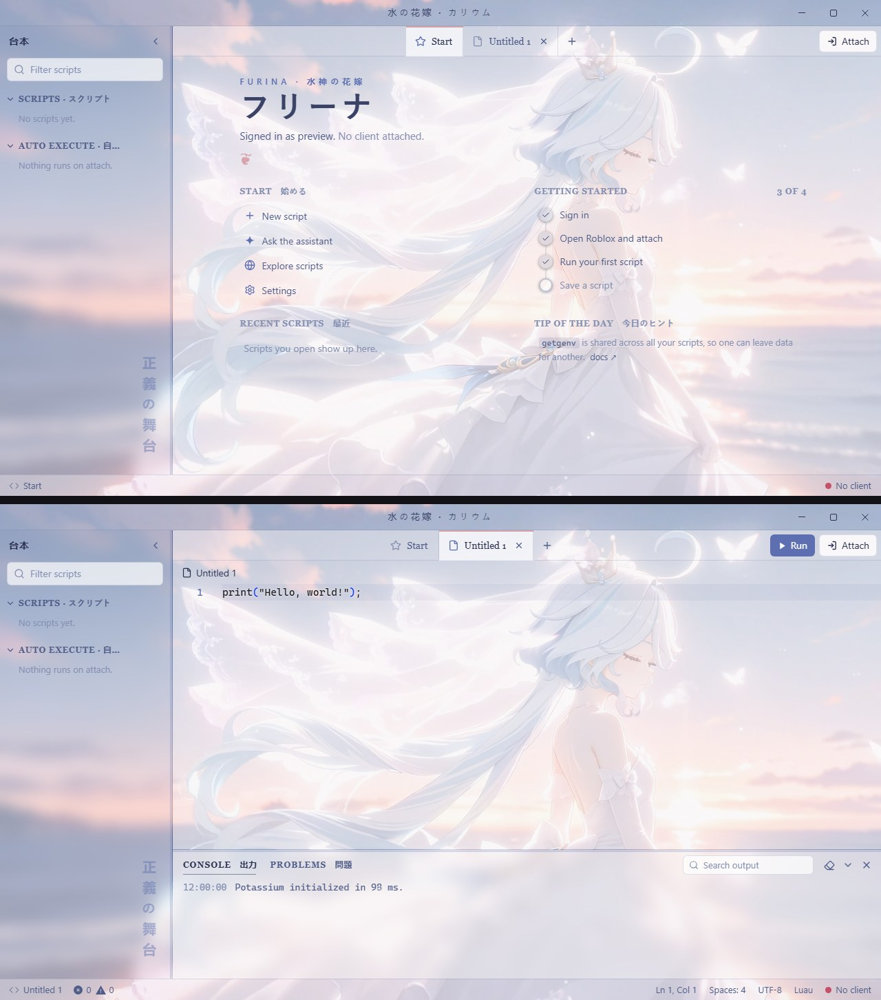
</picture>

<picture>
  <source srcset="furina/loading.avif" type="image/avif">
  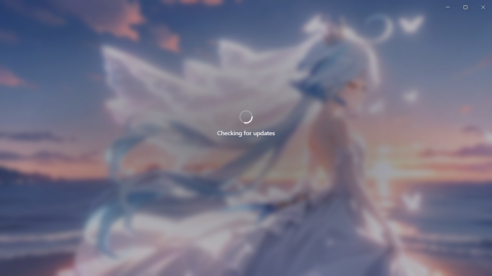
</picture>

[`Theme.css`](furina/Theme.css) · Base: **Light** · 水の花嫁 · 台本 · 正義の舞台

What the Japanese means

| Text | Reading | Meaning |
|---|---|---|
| 水の花嫁 | mizu no hanayome | Bride of water (title bar) |
| 台本 | daihon | A theatre script (explorer): Furina is an actress, and this is where your scripts live |
| 水神の花嫁 | suijin no hanayome | Bride of the Hydro god |
| フリーナ | Furīna | Her name |
| 正義の舞台 | seigi no butai | Stage of justice, a nod to Fontaine's courtroom opera |

## Sea of Flowers · 花の海

<picture>
  <source srcset="sea-of-flowers/screens.avif" type="image/avif">
  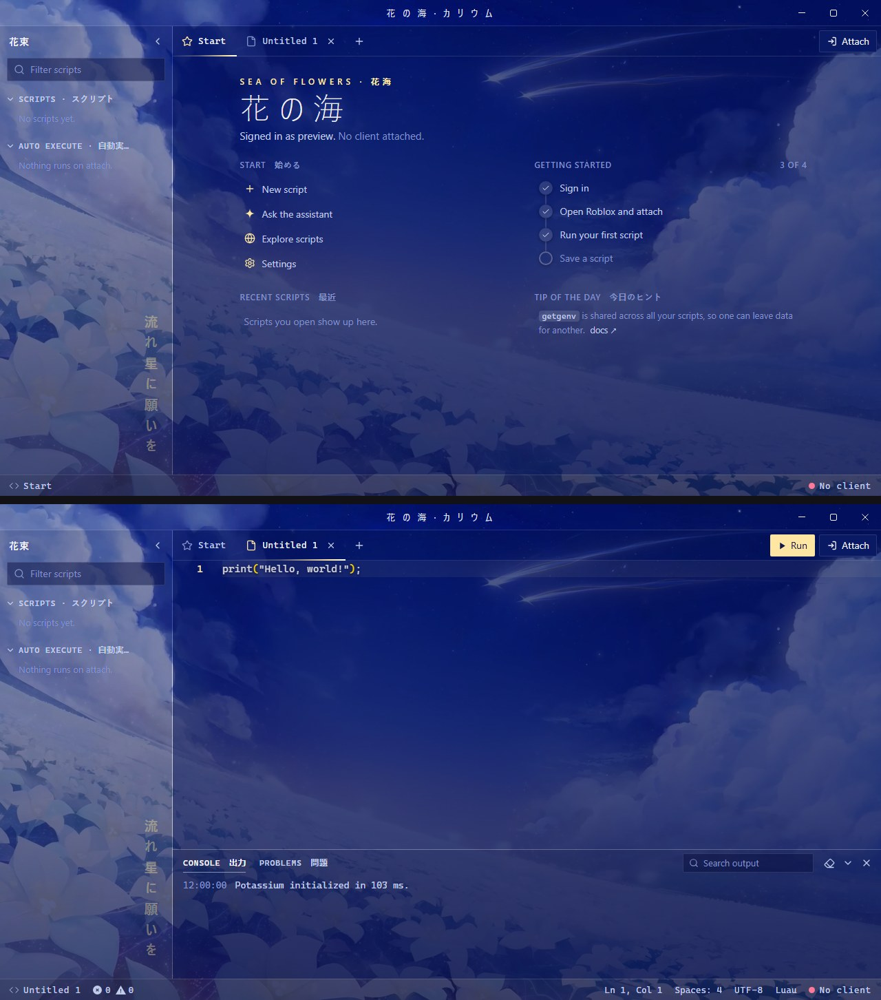
</picture>

<picture>
  <source srcset="sea-of-flowers/loading.avif" type="image/avif">
  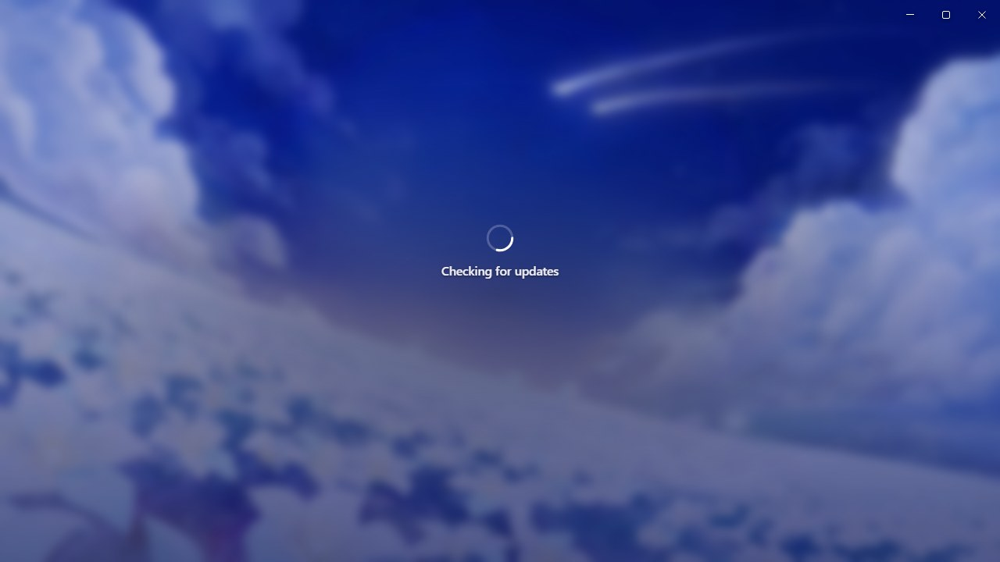
</picture>

[`Theme.css`](sea-of-flowers/Theme.css) · Base: Dark · 花海 · 花束 · 流れ星に願いを

What the Japanese means

| Text | Reading | Meaning |
|---|---|---|
| 花の海 | hana no umi | Sea of flowers (title bar) |
| 花海 | kakai | Flower sea |
| 花束 | hanataba | Bouquet (explorer) |
| 流れ星に願いを | nagareboshi ni negai o | Make a wish on a shooting star |

## Raiden Shogun · 雷電将軍

<picture>
  <source srcset="raiden/rain-screens.avif" type="image/avif">
  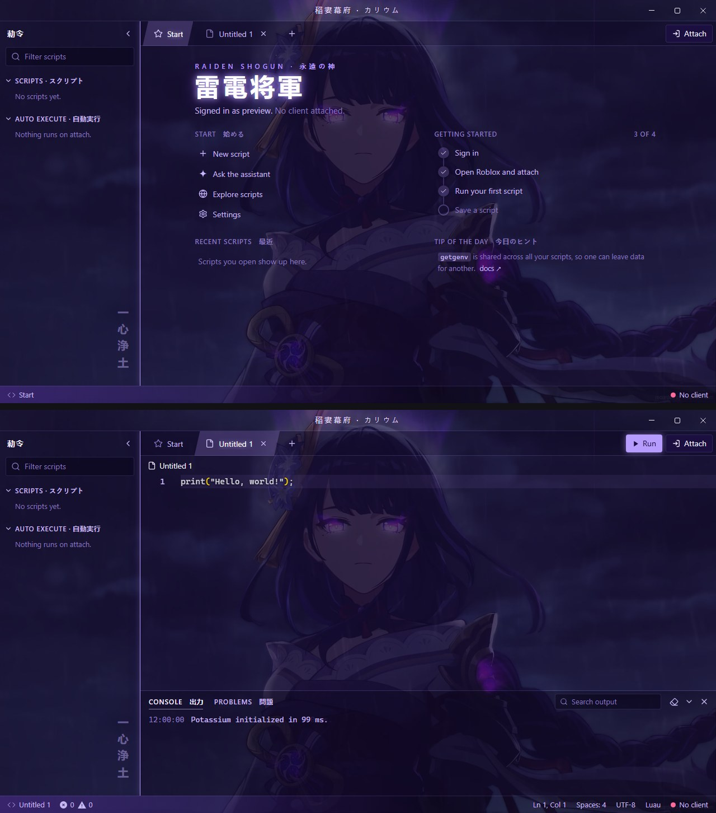
</picture>

<picture>
  <source srcset="raiden/rain-loading.avif" type="image/avif">
  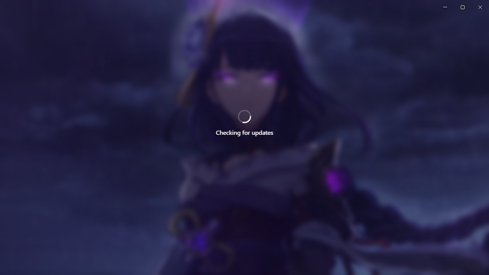
</picture>

[`Theme.css`](raiden/Theme.css) · Base: Dark · 稲妻幕府 · 勅令 · 一心浄土

What the Japanese means

| Text | Reading | Meaning |
|---|---|---|
| 稲妻幕府 | Inazuma Bakufu | The Inazuma Shogunate (title bar) |
| 勅令 | chokurei | Imperial decree (explorer) |
| 永遠の神 | eien no kami | God of eternity |
| 雷電将軍 | Raiden Shōgun | Her title |
| 一心浄土 | Isshin Jōdo | The Plane of Euthymia, her inner realm |

The source GIF is square, so instead of stretching it across the window this theme pins it to the right at full height and fades it into purple on the left.

## Clorinde · クロリンデ

<picture>
  <source srcset="clorinde/screens.avif" type="image/avif">
  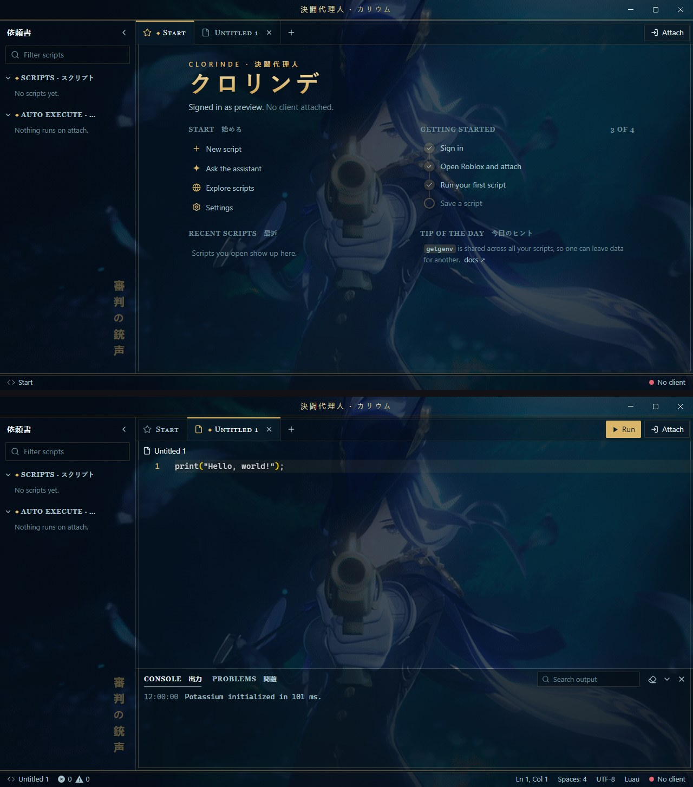
</picture>

<picture>
  <source srcset="clorinde/loading.avif" type="image/avif">
  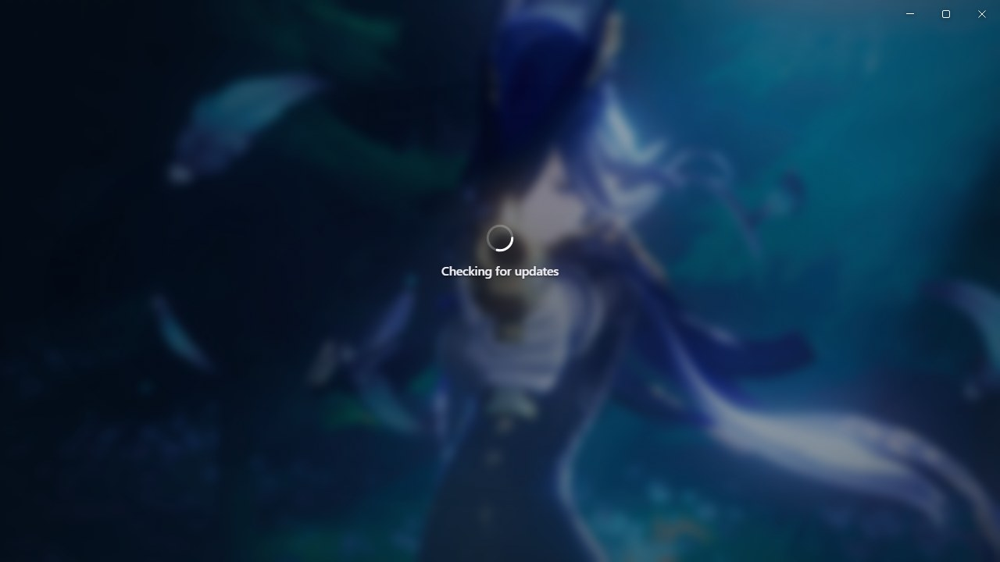
</picture>

[`Theme.css`](clorinde/Theme.css) · Base: Dark · 決闘代理人 · 依頼書 · 審判の銃声

What the Japanese means

| Text | Reading | Meaning |
|---|---|---|
| 決闘代理人 | kettō dairinin | Champion duelist, who fights duels on others' behalf (title bar) |
| 依頼書 | iraisho | Commission letters (explorer) |
| クロリンデ | Kurorinde | Her name |
| 審判の銃声 | shinpan no jūsei | The gunshot of judgment |

## Notes

- Wallpapers are animated AVIF files (0.3 to 4 MB) loaded from this repo, so you need internet the first time. If a wallpaper can't load, the colours still apply.
- Potassium cuts custom CSS off at 50,000 characters. Each theme is about 6,000, so there's room for your own tweaks.
- The layouts target Potassium's internal class names. A future Potassium update could rename them; if that happens, the colours keep working but some layout touches may not.

## Credits

Genshin Impact and its characters belong to HoYoverse. Six of the wallpapers are converted from live wallpapers posted on [MoeWalls](https://moewalls.com):
[Yae Miko Sakura Cherry Blossoms](https://moewalls.com/anime/yae-miko-sakura-cherry-blossoms-genshin-impact-live-wallpaper/),
[Kujou Sara Ronin](https://moewalls.com/anime/kujou-sara-ronin-genshin-impact-live-wallpaper/),
[Moontide Sea](https://moewalls.com/anime/moontide-sea-genshin-impact-live-wallpaper/),
[Bride Furina](https://moewalls.com/anime/bride-furina-genshin-impact-live-wallpaper/),
[Sea of Flowers](https://moewalls.com/anime/sea-of-flowers-genshin-impact-live-wallpaper/) and
[Raiden Shogun in the Rain](https://moewalls.com/anime/raiden-shogun-in-the-rain-genshin-impact-live-wallpaper/).

The Clorinde wallpaper is converted from a GIF on [KLIPY](https://klipy.com): [Clorinde](https://klipy.com/gifs/clorinde-3).
