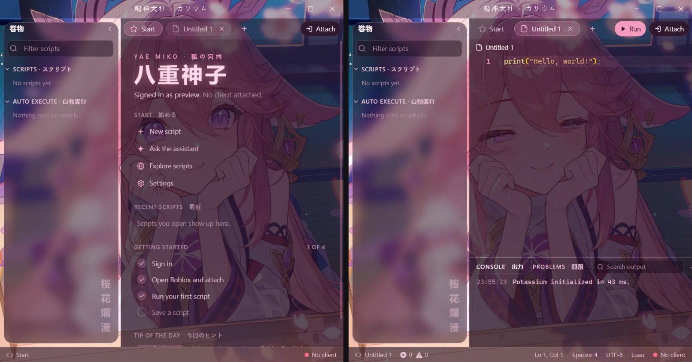
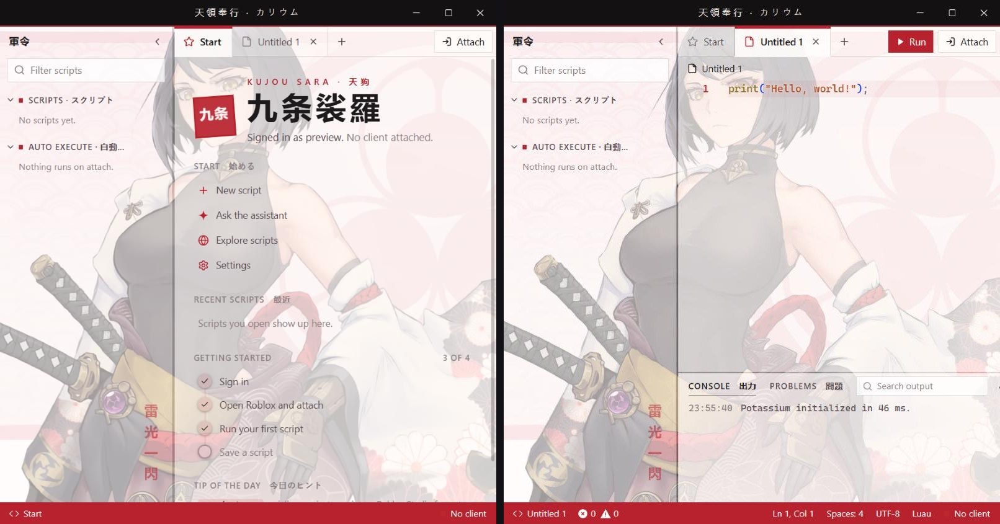
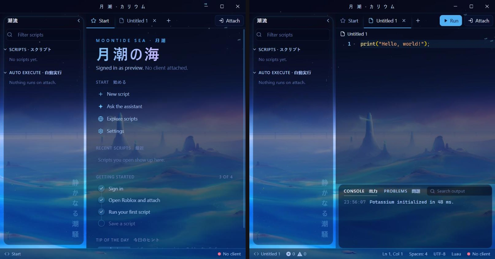
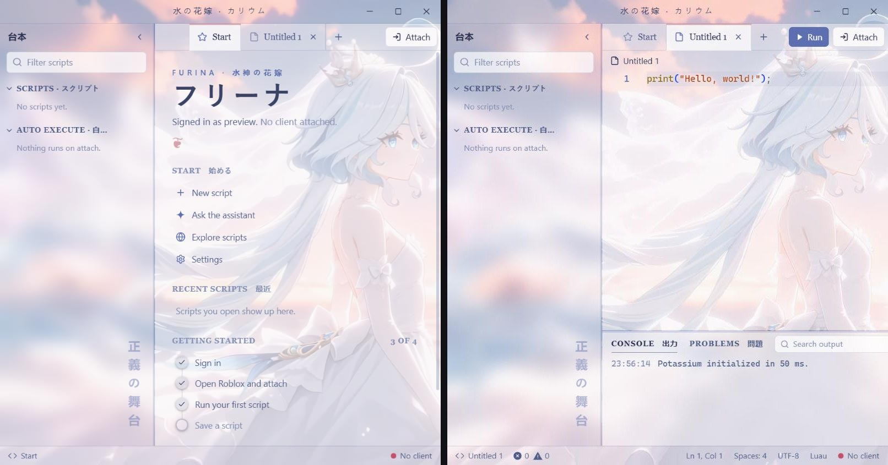
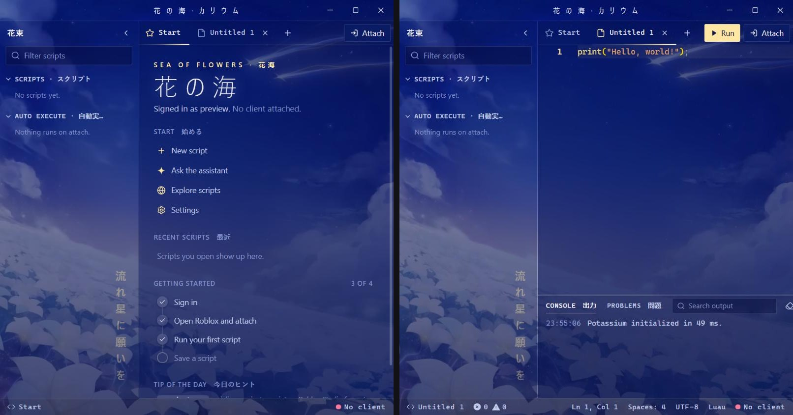

# Genshin Impact themes for Potassium

Five animated Genshin Impact themes for the Potassium executor. Each one has its own colour palette, its own layout and its own Japanese labels, with a looping wallpaper playing behind the whole app.

| Theme | Base theme | Look |
|---|---|---|
| [Yae Miko](#yae-miko--八重神子) | Dark | Sakura-pink shrine glass, pill tabs, floating explorer card |
| [Kujou Sara](#kujou-sara--九条裟羅) | **Light** | Paper and ink, square corners, black title band, crimson status bar, seal stamp |
| [Moontide Sea](#moontide-sea--月潮の海) | Dark | Deep-sea glass, glowing floating panels, gradient heading |
| [Bride Furina](#bride-furina--フリーナ) | **Light** | Frosted veil, serif type, centred tabs, double borders |
| [Sea of Flowers](#sea-of-flowers--花の海) | Dark | Minimal starfall, monospace labels, shooting-star tab underline |

## Install

1. In Potassium, open **Settings → Appearance → Custom theme**.
2. Set **Base theme** to the one listed for that theme (Dark or **Light**). The editor's syntax colours come from the base theme.
3. Open the theme's folder, copy everything in its `Theme.css` and paste it into **Custom CSS**.
4. Type a name under **Save** and click **Save**.

## Yae Miko · 八重神子

[`Theme.css`](yae-miko/Theme.css) · Base: Dark · 鳴神大社 · 巻物 · 桜花爛漫

## Kujou Sara · 九条裟羅

[`Theme.css`](kujou-sara/Theme.css) · Base: **Light** · 天領奉行 · 軍令 · 雷光一閃

## Moontide Sea · 月潮の海

[`Theme.css`](moontide/Theme.css) · Base: Dark · 月潮 · 潮流 · 静かなる潮騒

## Bride Furina · フリーナ

[`Theme.css`](furina/Theme.css) · Base: **Light** · 水の花嫁 · 台本 · 正義の舞台

## Sea of Flowers · 花の海

[`Theme.css`](sea-of-flowers/Theme.css) · Base: Dark · 花海 · 花束 · 流れ星に願いを

## Notes

- Wallpapers are animated AVIF files (1920×1080, 30 fps, 0.9 to 4 MB) loaded from this repo, so you need internet the first time. If a wallpaper can't load, the colours still apply.
- Potassium cuts custom CSS off at 50,000 characters. Each theme is about 6,000, so there's room for your own tweaks.
- The layouts target Potassium's internal class names. A future Potassium update could rename them; if that happens, the colours keep working but some layout touches may not.

## Credits

Genshin Impact and its characters belong to HoYoverse. The wallpapers are converted from live wallpapers posted on [MoeWalls](https://moewalls.com):
[Yae Miko Sakura Cherry Blossoms](https://moewalls.com/anime/yae-miko-sakura-cherry-blossoms-genshin-impact-live-wallpaper/),
[Kujou Sara Ronin](https://moewalls.com/anime/kujou-sara-ronin-genshin-impact-live-wallpaper/),
[Moontide Sea](https://moewalls.com/anime/moontide-sea-genshin-impact-live-wallpaper/),
[Bride Furina](https://moewalls.com/anime/bride-furina-genshin-impact-live-wallpaper/) and
[Sea of Flowers](https://moewalls.com/anime/sea-of-flowers-genshin-impact-live-wallpaper/).
